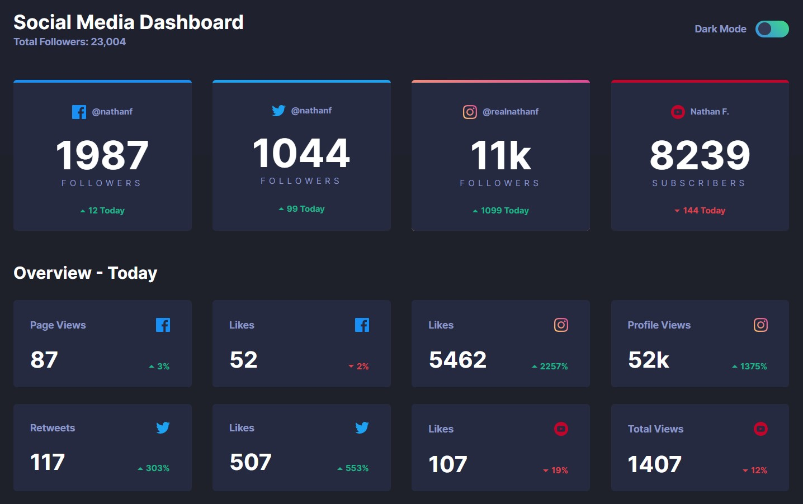
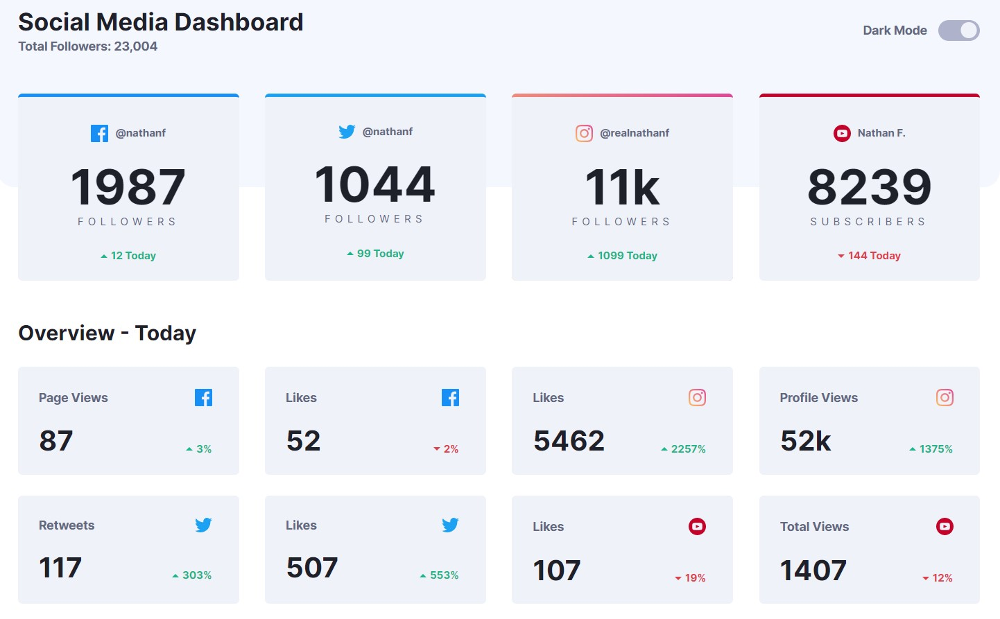
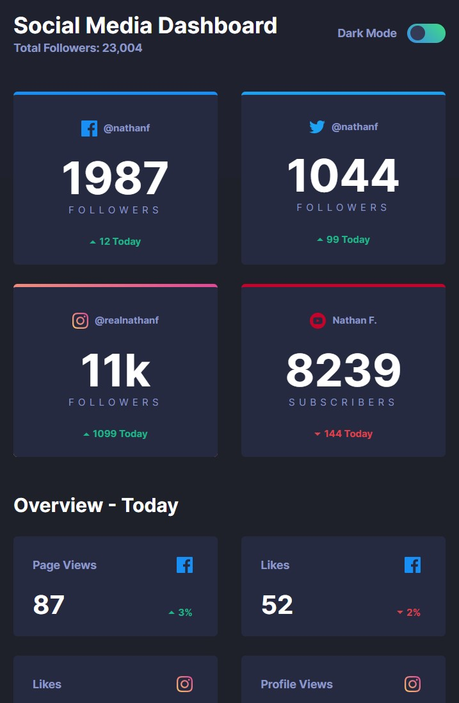
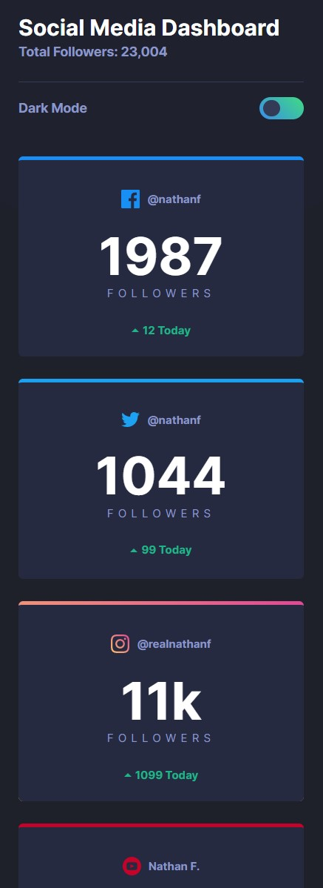

# Frontend Mentor - Social media dashboard with theme switcher solution

This is a solution to the [Social media dashboard with theme switcher challenge on Frontend Mentor](https://www.frontendmentor.io/challenges/social-media-dashboard-with-theme-switcher-6oY8ozp_H). Frontend Mentor challenges help you improve your coding skills by building realistic projects. 

### Links

- Solution URL: https://github.com/aaronrubinstein/social-media-dashboard
- Live Site URL: https://aaronrubinstein.github.io/social-media-dashboard/

### Screenshot

**Dark Theme**

**Light Theme**

**Tablet**

**Mobile**

